# [멋쟁이사자처럼] 프론트엔드 스쿨 6기 - HTML/CSS 프로젝트

## 🚀 TAING

멋쟁이사자처럼의 프론트엔드 스쿨 6기 과정 중, 1달 간의 HTML 및 CSS 과정 마무리에 진행된 팀 프로젝트입니다. <br>
TVING 홈페이지를 기반으로 제작된 Figma 시안을 바탕으로 하였으며, 프로젝트 시작 전 팀 내 협의 후, Sass 를 이용해 개발 진행되었습니다.
<br>

**🪩 배포 주소**
https://tvin8.netlify.app/

**💻 Stack**

<br>

---

## 📸 Project 미리보기


---

## 🗓️ Project 기간

2023년 06월 23일 (금) ~ 2023년 06월 28일 (수)
<br><br>

## 👩‍💻🧑‍💻 Project 팀

### 팀명: 8이피플

**그 어떤 프로젝트도 PARTY🍷처럼 즐기는 8이피플 입니다 😎**

- 김다연: 메인 페이지 (Quick VOD, 인기 프로그램 영역, 하단 스포츠 라이브 배너 및 이벤트 일부), 프로필 선택 페이지, 프로필 편집 페이지
  <br>
- 신명화: 메인 페이지 (인기 라이브 채널, 오직 티빙에만 있어요, 하단 공지사항 및 사이트 정보 일부), 로그인 페이지, footer 일부
  <br>
- 유동균: 메인 페이지 (네비게이션 바, 헤더 배너, 티빙에서 꼭 봐야하는 콘텐츠), 메인 페이지에 연동된 검색창, 랜딩 페이지
  <br>
- 조수연: 메인 페이지 (하단 스포츠 라이브 ~ 하단 사이트 정보)
  <br><br>

---

## 🫂 협업을 위한 기본 Setting

### 1. git 협업을 위한 사전 training [팀원 공통]

프로젝트 중 잘못된 git 사용으로 인해 발생할 수 있는 문제를 사전에 방지하고자, 사전에 test 용 git repository 를 생성함. 해당 repository 로 디스코드로 화면 공유 하면서 스크럼 마스터 부터 팀원들까지 한 사람씩 git pull, branch 생성, push, merge 등을 연습함. <br> 이후로도 git 사용 시 어려움을 겪는 경우, 혼자 해결하지 않고 화면 공유를 통해 함께 결정하기로 협의하였으며, **프로젝트 시작부터 끝까지 git 이슈는 없었음.**
<br>

### 2. Project Guide 수립 [유동균님]

프로젝트 시작 전 git 연습과 더불어, Sass 활용 방법, Pull Request 시 작성되어야 하는 template 등을 협의함. 해당 내용을 동균님께서 정리하셨으며, 프로젝트조 노션에 공유 및 설명을 진행해주셨음. 이후로도 git 활용 시 문제가 생겨 해결한 내용이나 추가 협의된 내용을 지속해서 보완 완료함.

https://www.notion.so/Project-Guide-a056c316004a4c2781ed4aa6bf035104
<br>

### 3. Coding Convention 수립 [김다연님]

각자 맡은 Section 개발을 시작하기 전, Coding Convention 을 수립하여 클래스 네이밍 규칙, 이미지 네이밍 규칙, 레이아웃 약속어 등 기본적으로 팀원들이 함께 지켜 개발할 수 있는 Coding Convention 을 수립함. 따라서 팀원 전체가 통일성 있는 class 명과 image 명, layout 명 등을 사용할 수 있었으며, 협의된 규칙으로 개발을 진행하였기 때문에 팀원 간 코드 리뷰 시, 시간 단축됨.

https://www.notion.so/8-Coding-Convention-46852f41e5fb48608a687e0b1038f26c
<br>

---

## 🗄️ 프로젝트 관리

### 🗂️ Git Project

프로젝트 과정 진행 현황을 실시간으로 확인하고, 담당 내용, 담당 항목, 실시 기간 등을 프로젝트 milestone 에 따라 기록할 수 있도록 하기 위해 git project 를 채택하여 사용하였습니다.
<br>

### 🗃️ Git Project 링크

https://github.com/users/dani-day/projects/2/views/5?filterQuery=label%3A
<br>

### 📸 Git Project 스크린샷


<br>

---

## 🙋🏼‍♀️ Section 별 마크업 및 주요 스타일링

### 1. 메인페이지

### 1-1. 메인 헤더 [유동균]

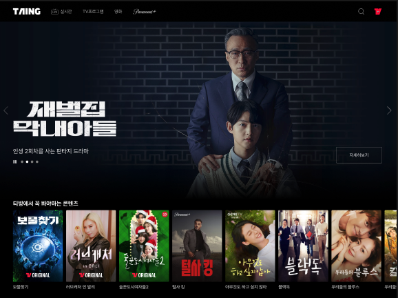

- 헤더
  부모 요소인 `<header class="header">` 내부에는, <br>

1. title을 의미하는 `<h1 class="header__logo">`요소과
2. 네비게이션 메뉴인 `<nav class="header__nav">`가 있다.
   2.1 네비게이션 메뉴에는 프로그램을 위한 리스트인 `<ul class="header__nav__program">`과
   2.2 검색, 사용자 정보의 리스트인 `<ul class="header__nav__search">`가 있다.
3. 부모요소인 `<header class="header">`에는 모달창의 바깥 여백의 디자인을 담당하는 `< class="overlay">`와 검색창인 `<div class="search" role="dialog" >`가있다.
   3.1 모달창에는 `aria-labelledby="searchModal" aria-modal="true"`속성을 주어 모달창임일 알려주었다.
4. 모달창 내부에는 title을 담당하는 `<h3 class="a11yHidden" id="searchModal">`요소와 form 영역이 존재한다.

- 배너 섹션

1. 슬라이드 배너를 담당하는 섹션으로 `<section class="banner">`가 부모이며 그 안에는 이미지와 슬라이드 이미지를 컨트롤할 버튼들과 이미지에 관한 간단한 설명이 담긴 `<p class="banner__subtext">` 단란과 더보기 링크가 존재한다.
2. 이미지는 자바스크립트를 이용해 자동으로 변경되게 하였으며 각각의 버튼을 클릭해 이동과 전환이 가능하다.

- 티빙에서 꼭 봐야하는 콘텐츠

1. 부모를 담당하는 `<section class="must">` 밑으로 제목을 담당하는 `<h2 class="must__title">`과 리스트의 overflow를 담당하는 박스와 리스트가 존재한다.
   `<div class="must__list__wrapper">` `<ul class="must__list">`
2. 이미지는 마우스를 hover하면 위로 올라가는 애니메이션이 존재한다.

### 1-2. Quick VOD 및 실시간 인기 프로그램 [김다연]


- 마크업 구조
  - Quick VOD 와 실시간 인기 프로그램 section 태그로 구분함.
  - div 로 감싼 후 quick vod 는 ul 태그로, 실시간 인기프로그램은 ol 태그 사용함.
  - 아이템 마다 a 태그로 감싸 링크 만들어준 후, 제목 및 이외 글은 p 태그 사용함.
  - 특히 실시간 인기 프로그램은 포스터 및 글자 영역에 별도로 div 로 감싼 후, p 태그 안의 span 에서 제목 작성한 후 after 및 before 가상요소로 숫자 및 빨간 점 구현함.
    <br>
- 주요 스타일링 요약
  - 썸네일, 포스터 flexbox 사용하여 배열함.
  - 순위는 ::before 로 구현함.
  - 제목은 모두 ellipsis 처리되게 구현함.
  - ellipsis 처리된 제목 뒤 빨간 점 ::after 로 구현함.
    <br>
- figma 시안 외 구현 사항
  - 썸네일 hover 시 썸네일 및 제목 전체 위로 올라가는 효과

### 1-3. 인기 LIVE 채널 및 오직 티빙에만 있어요 [신명화]

- live 파트
  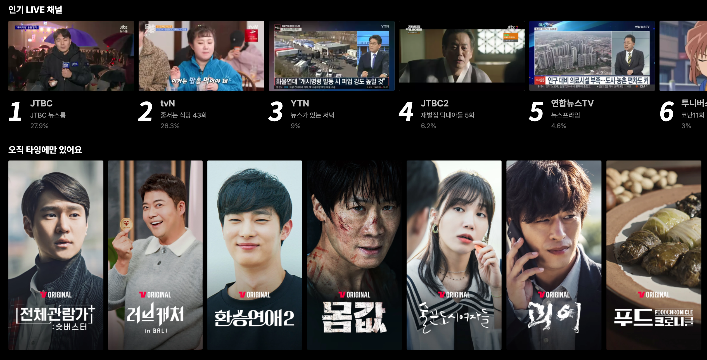

- 마크업 구조
  - 섹션 구분함
  - 디비전 박스로 싸줌
  - 헤딩태그로 타이틀 작성
  - 리스트스타일 ul/li태그 사용함
  - 포스터 내용 설명 창을 위해 dl>dd>dt 사용함
- 주요 스타일링 요약

  - 이미지 스크린샷 / 포스터 가로 배열함 **(flex)**
  - 누운 숫자 구현함 **(::after)**
  - 박스 호버시 해당 아이템만 단독 위로 상승함

- figma 시안 외 구현 사항 - 티빙 사이트
  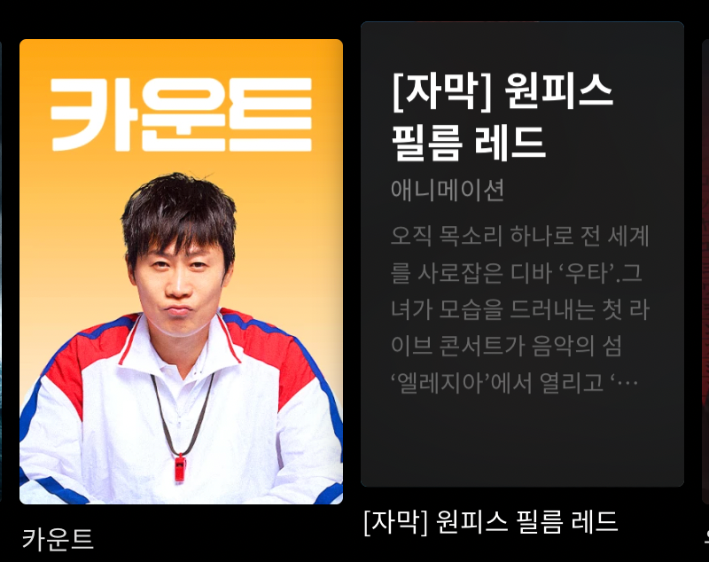
  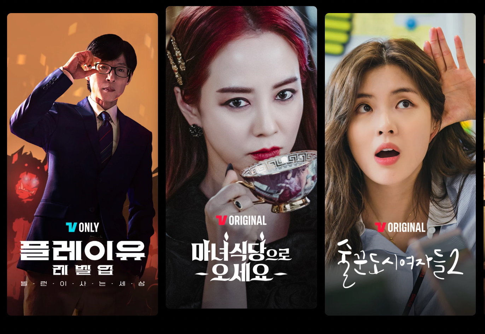

### 1-4. 배너, 이벤트 및 footer [조수연]

   <br>
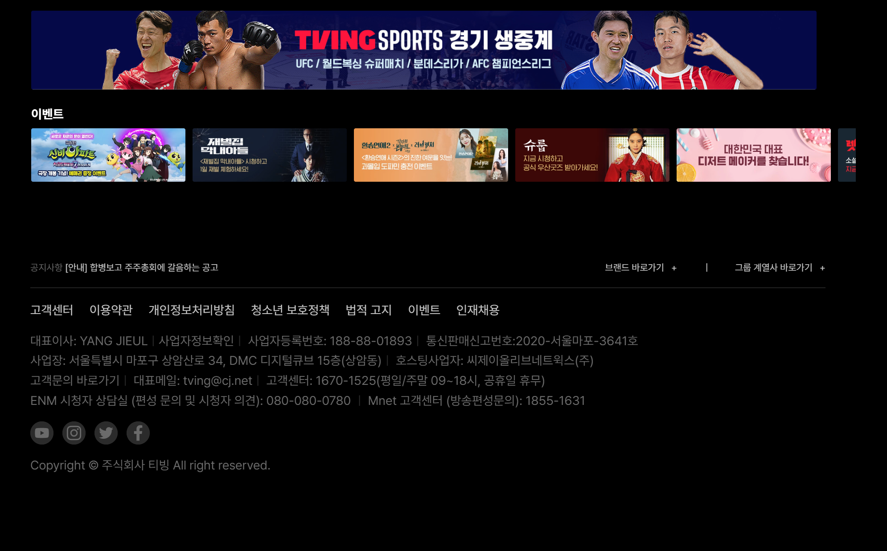

- 마크업 구조
  - 섹션과 푸터로 구분함
  - 대체 텍스트를 시각적으로 감추고자 a11yHidden을 이용함
  - sprite를 이용하여 푸터 이미지 배치함
- 주요 스타일링 요약

  - 마우스로 클릭시 페이지로 이동할 수 있음
  - 이미지를 가로로 배열함 sprit에 block을 줌
    <br/>

- figma 시안 외 구현사항 (유동균)
  <br>
  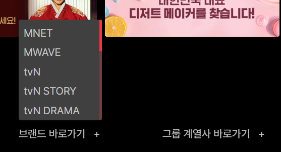
  <br>

  - 바로가기를 클릭했을 때 연동되는 리스트를 작성함
    <br>

- figma 시안 대비 미구현 사항
  <br>
  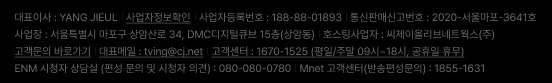

  - a 태그로 감싸진 링크로 연결된 부분 글씨 아래 밑줄 수행하지 못 함

  <br>

### 2. 랜딩 페이지


1. 렌딩페이지에는 총 5개의 섹션으로 구분되며 각각
   헤더와 푸터를 제외한
   `<section class="original">` `<section class="fun">` `<section class="look">` `<section class="new">`로 구성되어있다.
2. look 섹션에서는 자바스크립트를 이용하여 슬라이더 이미지를 구현하였다.

## 진행하지 못해서 아쉬운 부분

- [웹접근성 가이드 라인 및 체크리스트](https://sri-fe1.notion.site/32d50962016c4c90a04c8447298434fc?v=a01d06cb74ab41d88295d9d18123ab1f)

- [lighthouse](https://github.com/GoogleChrome/lighthouse)

- 자바스크립트를 이용한 효과에서 발생한 이슈

  1. 검색창이 열렸을 때 검색창 뒤로 포커스가 되는 현상
  2. 검색창을 닫는 keydown 이벤트를 주었지만 검색창이 닫혀있는 상태에서도 이벤트가 적용되어 esc키를 눌러도 검색창이 열림

- 미흡한 반응형 디자인

### 3. 프로필 [김다연]

desktop 버전으로만 구현되었습니다. (반응형 미구현)

### 3-1. 프로필 전환


<br>

### 3-2. 프로필 편집


<br><br>

---

## ⛑️ 주요 Issue

프로젝트 진행 중 해결하기 어려웠던 주요 Issue 입니다.

### 실시간 인기 프로그램

실시간 인기 프로그램의 숫자, 제목, red dot 개발 시, 아래 조건을 모두 만족시키는 마크업과 스타일링에 이슈가 있었습니다.

**1. 시도 내역**

1. wrapper > p 로 마크업하여 p 의 ::before 로 숫자를 주고, ::after 가상요소로 red dot 위치 시킴. -> ::before 숫자가 잘림. 해당 마크업에서 ::after 로 스타일링 시, css 에서 자식요소 순서를 일일히 세서 적용해야 함. 이미지 width 값을 고정하지 않으면 ellipsis 적용과 red dot 문제를 동시에 해결할 수 없음.

2. wrapper > p, span 으로 마크업. 이미지 width 값을 기준으로 ellipsis 가 적용되게 하고, span 에 red dot 을 만든 후 flex-shrink: 0 적용함. (flex-shrink 를 주지 않으면 해당 span 이 ellipsis 뒤에 위치해 보이지 않게됨) > 이미지 width 값을 고정하지 않으면 ellipsis 가 작동하지 않음.

3. 이외로도 p 나 wrapper 에 flex-basis 값 설정, flex: 1, flex-grow 등을 주는 순간 ellipsis 를 적용할 수 없음. 이미지가 flexible 하게 늘어나고 그에 맞춰 텍스트도 줄어들고 늘어나기 때문.

**3. 해결 방안**

webkit 사용 이 주된 해결방안이었으며, 동균님께서 발견 및 확인해주셨습니다.
아래 코드를 중심으로 마크업 및 스타일링 변경하여, 해결할 수 있었습니다.

```
  -webkit-line-clamp: 1;
  -webkit-box-orient: vertical;
  word-break: break-all;
  overflow: hidden;
  text-overflow: ellipsis;
  display: -webkit-inline-box;
```

---


### 오직 타잉에만 있어요

1. 호버시 해당 아이템 위로 상승 **transition** 구현함 **transform , translate Y**축으로 이동 후 호버시 *0*으로 회귀하게 반영함 ex) 12px->0
   <br>
   
   <br>

2) 호버시 해당 아이템 위로 상승 후 아이템 전환되며 **opacity: 0**으로 가려둔 설명창**opacity:1**으로 전환됨
   <br>
   
   <br>

---

## 📊 Project 사이트 성능 검사 결과

### 이미지 파일을 `picture` 요소의 `soure`를 사용해 차세대 형식의 이미지를 제공

> 아직 호환이 되지 않는 브라우저에서는 `.png` 파일의 이미지가 출력된다.

### 성능최적화를 위한 이미지 변환 전

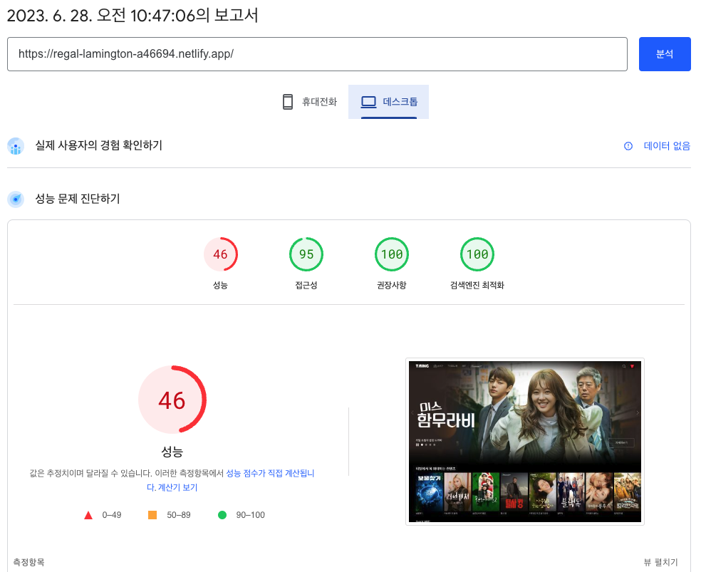
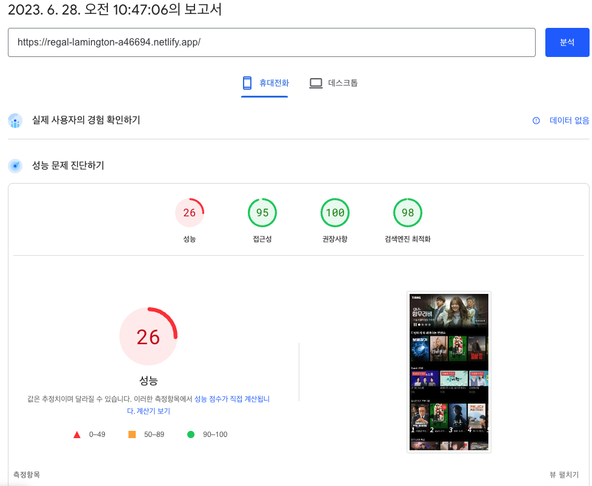

### 이미지 최적화 .png > .webp

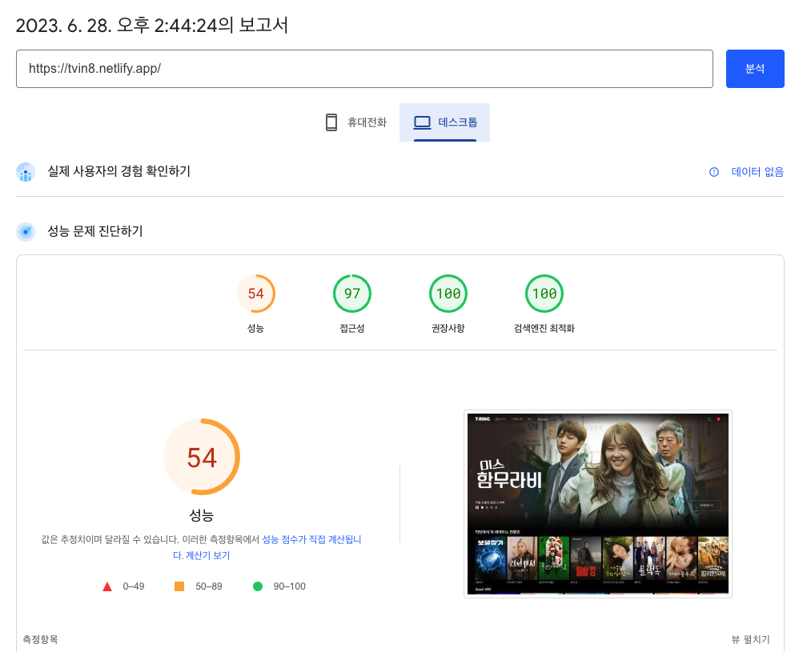
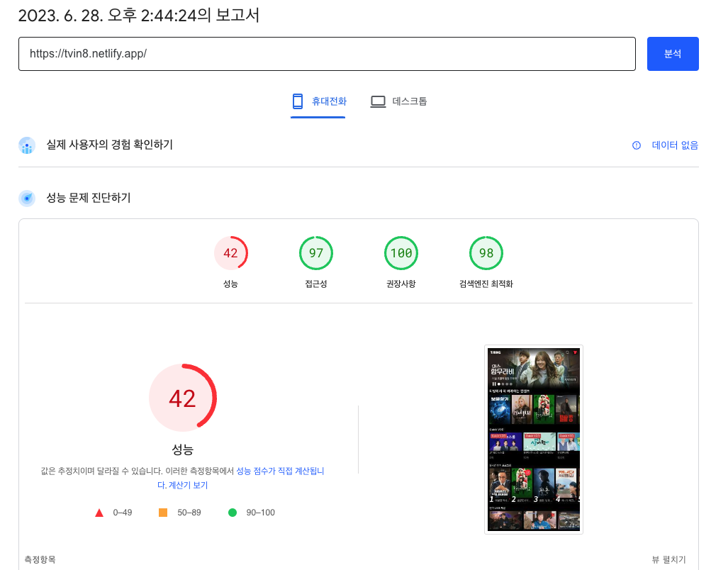

```
  <picture>
    <source srcset="./images/적용될webp이미지.webp" type="image/webp" />
    
  </picture>
```

### HTML Validator

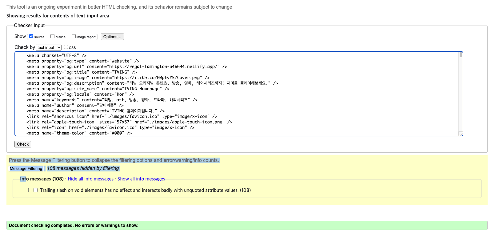

### 모바일 친화성 테스트

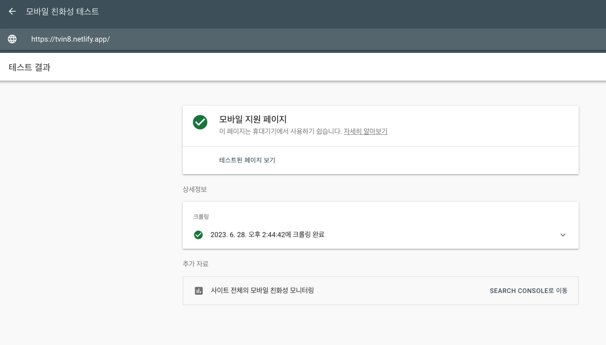
<br><br>
